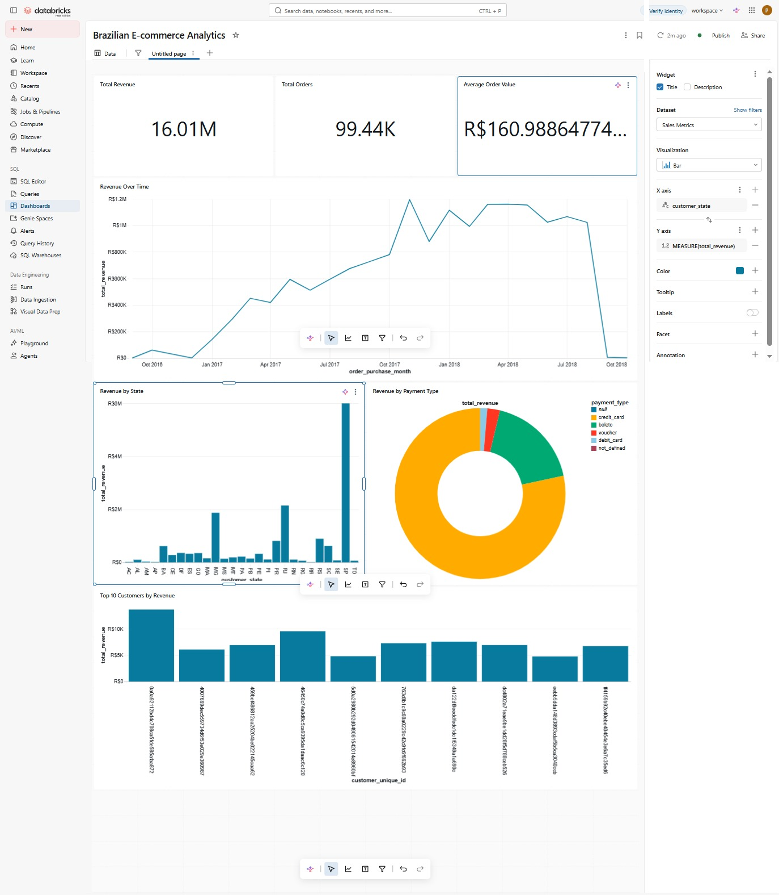

# 🛒 E-Commerce Data Lakehouse Project

Welcome to the **E-Commerce Data Lakehouse Project**! This repository demonstrates a modern data architecture designed to process, store, and analyze e-commerce data efficiently using a Lakehouse approach.

## 🚀 Overview

This project implements a multi-hop data architecture (Medallion Architecture) to refine raw e-commerce data into high-quality, actionable insights.

- **Bronze Layer**: Raw data ingestion.
- **Silver Layer**: Filtered, cleaned, and augmented data (`silver_layer_etl.py`).
- **Gold Layer**: Business-level aggregates and reporting-ready data (`gold_layer_etl.py`).

## 🏗️ Architecture

Below is the high-level architecture of the Data Lakehouse:


## 📊 Dashboards & Analytics

We leverage the Gold layer data to power insightful dashboards for business stakeholders. 

### Sales Dashboard


### Data Catalog


## 📁 Project Structure

```text
ecommerce-data-lakehouse-project/
├── notebooks/
│   ├── silver_layer_etl.py    # ETL logic for the Silver layer
│   └── gold_layer_etl.py      # ETL logic for the Gold layer
├── screenshots/               # Architectural diagrams and dashboard previews
└── README.md                  # Project documentation
```

## 🛠️ Getting Started

1. Clone this repository:
   ```bash
   git clone https://github.com/lohith459/ecommerce-data-lakehouse-project.git
   ```
2. Navigate to the notebooks directory and run the ETL pipelines:
   ```bash
   python notebooks/silver_layer_etl.py
   python notebooks/gold_layer_etl.py
   ```

## 🤝 Contributing
Contributions are welcome! Please feel free to submit a Pull Request.

## 📝 License
This project is licensed under the MIT License.
